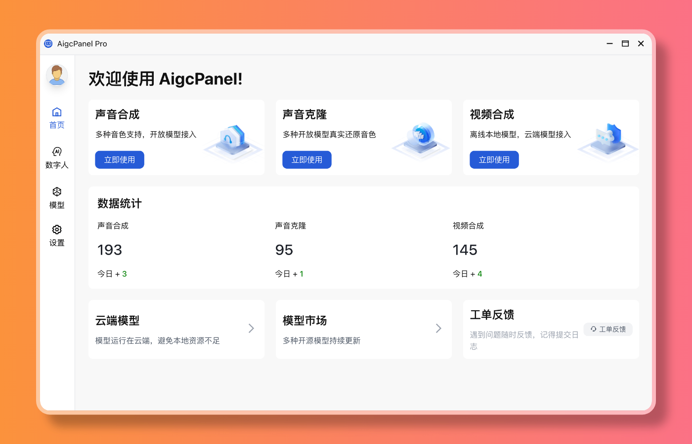
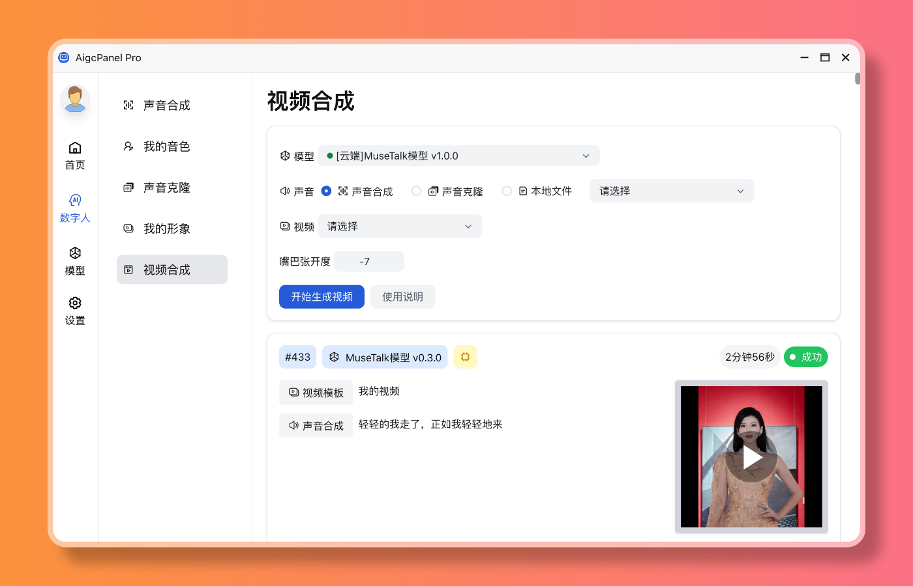
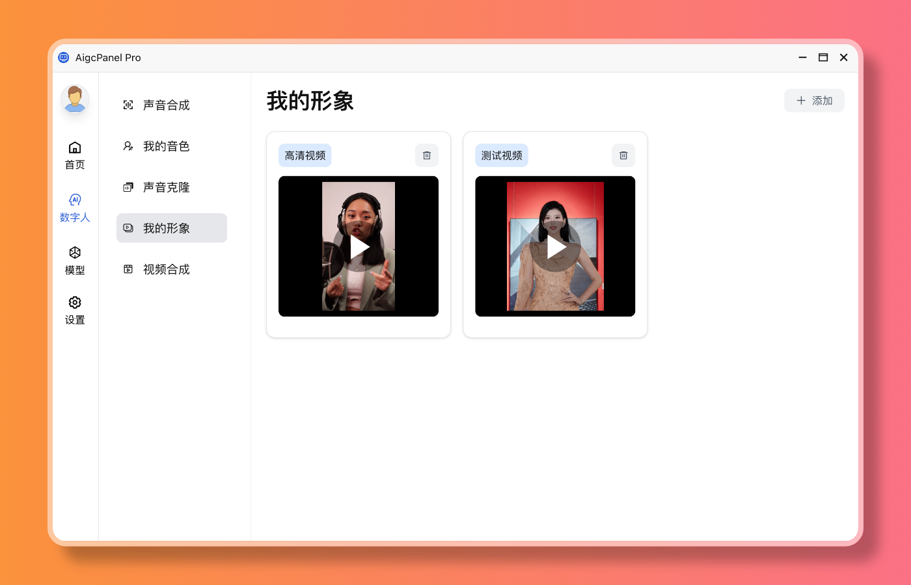
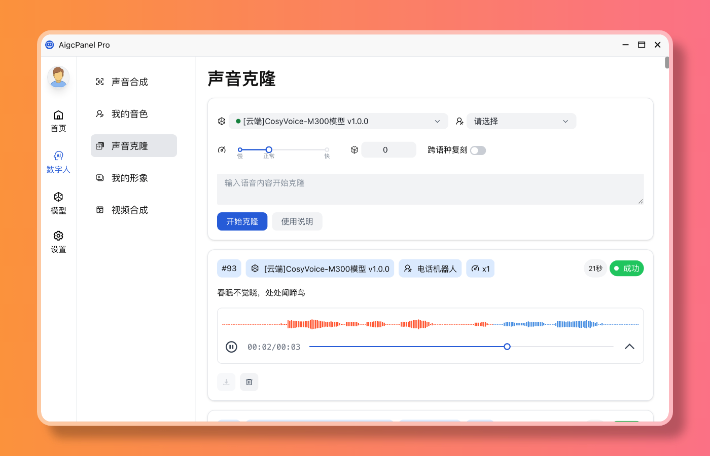
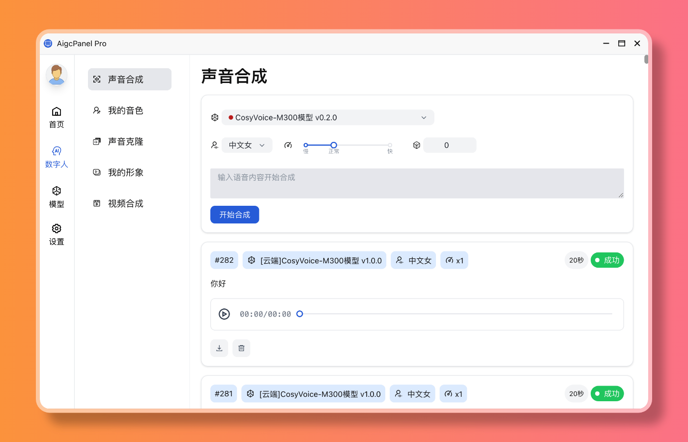
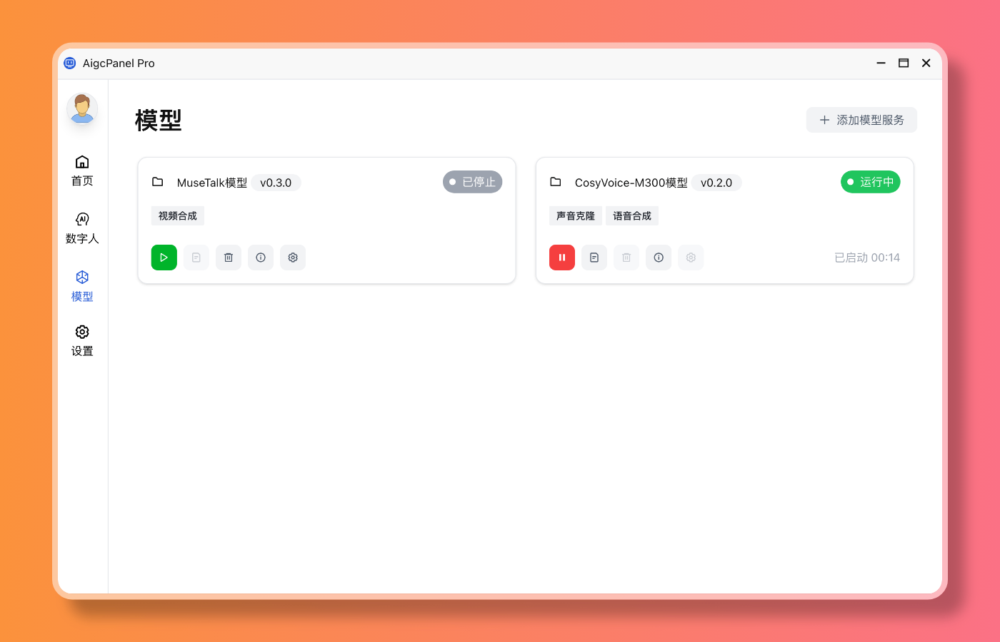

# AIGCPanel




[](https://aigcpanel.com)
[](https://github.com/modstart-lib/aigcpanel)
[](https://gitee.com/modstart-lib/aigcpanel)
[](https://gitcode.com/modstart-lib/aigcpanel)

## 软件介绍

`AIGCPanel` 是一款简单易用的一站式 AI 数字人系统，即使是小白用户也能轻松上手。它集成了视频合成、语音合成、语音克隆等核心功能，大大简化了本地 AI 模型的管理流程，支持一键导入和使用各种 AI 模型，让 AI 创作变得触手可及。

> **重要提醒**：禁止使用本产品进行任何违法违规业务，请在使用本软件时严格遵守中华人民共和国法律法规。

## 目录

- [AIGCPanel](#aigcpanel)
  - [软件介绍](#软件介绍)
  - [目录](#目录)
  - [功能特性](#功能特性)
  - [模型支持](#模型支持)
    - [声音合成](#声音合成)
    - [声音识别](#声音识别)
    - [视频模型](#视频模型)
  - [功能预览](#功能预览)
    - [视频合成](#视频合成)
    - [我的形象](#我的形象)
    - [语音克隆](#语音克隆)
    - [语音合成](#语音合成)
    - [模型管理](#模型管理)
    - [工具箱](#工具箱)
    - [工作流](#工作流)
  - [安装使用](#安装使用)
    - [Windows](#windows)
    - [macOS](#macos)
    - [Linux](#linux)
  - [技术栈](#技术栈)
  - [本地运行开发](#本地运行开发)
  - [命令行工具](#命令行工具)
  - [贡献指南](#贡献指南)
  - [问题报告](#问题报告)
  - [更新日志](#更新日志)
  - [加入交流群](#加入交流群)
  - [License](#license)

## 功能特性

- **视频数字人合成**：支持视频画面与声音的精准换口型匹配，打造逼真数字人效果
- **语音处理**：提供语音合成、语音克隆、语音识别、视频声音替换功能，支持多种声音参数自定义设置
- **工具箱**：内置 20+ 实用工具，涵盖声音处理（长文本转音频、字幕转音频、音频规范化）、图像生成（文生图、图生图）、视频处理（背景添加、智能剪辑、片段放大、标注、字幕、变速、尺寸转换、压缩、合并、格式转换、FFmpeg 处理）等
- **工作流编排**：可视化工作流编辑器，支持大模型调用、JS 脚本、条件分支、MCP 工具调用、文件操作等多节点自由搭配
- **直播互动**：支持直播知识库管理、直播控制台、互动事件处理与播报历史查看
- **模型管理**：支持多模型导入、一键启动、远程模型调用、模型配置、日志查看等便捷操作
- **命令行工具**：提供 `aigcpanel` CLI，支持模型列表查询和模型函数调用，可一键安装到系统路径
- **国际化支持**：内置简体中文和英语界面，满足不同用户需求
- **一键启动包**：提供多种模型的一键启动包，快速部署和使用

## 模型支持

### 声音合成

- 声音模型 [CosyVoice-300M](https://github.com/FunAudioLLM/CosyVoice)
- 声音模型 [CosyVoice-300M-Instruct](https://github.com/FunAudioLLM/CosyVoice)
- 声音模型 [CosyVoice2-0.5b](https://github.com/FunAudioLLM/CosyVoice)
- 声音模型 [FishSpeech](https://github.com/fishaudio/fish-speech)
- 声音模型 [IndexTTS](https://github.com/index-tts/index-tts)
- 声音模型 [SparkTTS](https://github.com/SparkAudio/Spark-TTS)
- 声音模型 [GPT-SoVITS](https://github.com/RVC-Boss/GPT-SoVITS)

### 声音识别

- 声音识别模型 [FunASR](https://github.com/modelscope/FunASR)

### 视频模型

- 视频模型 [MuseTalk](https://github.com/TMElyralab/MuseTalk)
- 视频模型 [LatentSync](https://github.com/bytedance/LatentSync)
- 视频模型 [Wav2Lip](https://github.com/Rudrabha/Wav2Lip)
- 视频模型 [Heygem](https://github.com/duixcom/Duix.Heygem)

## 功能预览

### 视频合成



### 我的形象



### 语音克隆



### 语音合成



### 模型管理



### 工具箱

内置 20+ 实用工具，分为声音处理、图像生成、视频处理三大类，覆盖日常 AI 创作所需的各类音视频处理需求。

### 工作流

可视化工作流编辑器，支持以下节点类型自由组合：

| 节点类型 | 说明 |
|---|---|
| 大模型（LLM） | 调用大模型生成文本 |
| JS 脚本 | 执行自定义 JavaScript 逻辑 |
| 条件分支 | 根据条件控制流程走向 |
| MCP 工具调用 | 调用 MCP 协议工具 |
| 文件操作 | 文件复制、移动、列表读取 |
| 变量 / 随机值 | 定义变量或生成随机数据 |
| 正则提取 | 从文本中提取结构化内容 |

## 安装使用

### Windows

- 访问 [https://aigcpanel.com](https://aigcpanel.com) 下载 Windows 安装包，一键安装即可

安装完成后，打开软件，下载模型一键启动包，即可使用。

### macOS

- 访问 [https://aigcpanel.com](https://aigcpanel.com) 下载 macOS 安装包（支持 Intel 和 Apple Silicon）
- 双击安装包进行安装
- 首次运行可能需要允许来自未知开发者的应用

安装完成后，打开软件，下载模型一键启动包，即可使用。

### Linux

- 访问 [https://aigcpanel.com](https://aigcpanel.com) 下载 Linux 安装包（AppImage 或 deb 格式）
- 对于 AppImage：给予执行权限后直接运行
- 对于 deb：使用包管理器安装

安装完成后，打开软件，下载模型一键启动包，即可使用。

## 技术栈

本项目基于以下技术栈构建：

- **Electron**: 跨平台桌面应用框架
- **Vue 3**: 现代前端框架
- **TypeScript**: 类型安全的 JavaScript 超集

## 本地运行开发

> 仅在 node 20 测试过

```shell
# 安装依赖
npm install
# 调试运行
npm run dev
# 打包
npm run build
```

## 命令行工具

提供 `aigcpanel` CLI 命令行工具，支持：

- 查询可用模型列表
- 调用模型执行函数

可在设置界面一键安装到系统路径，也可手动将可执行文件加入 `PATH`。

```shell
# 查看帮助
aigcpanel --help
# 查询模型列表
aigcpanel model list
# 调用模型
aigcpanel model call <model> <function> [args...]
```

## 贡献指南

我们欢迎社区贡献！如果您想为 AIGCPanel 做出贡献，请：

1. Fork 本项目
2. 创建您的特性分支 (`git checkout -b feature/AmazingFeature`)
3. 提交您的更改 (`git commit -m 'Add some AmazingFeature'`)
4. 推送到分支 (`git push origin feature/AmazingFeature`)
5. 创建一个 Pull Request

## 问题报告

如果您遇到问题或有建议，请：

- 查看 [Issues](../../issues) 页面，确认问题是否已被报告
- 如果没有，请创建一个新的 Issue，并提供详细的描述和系统信息
- 对于技术支持，请加入我们的交流群

## 更新日志

查看 [CHANGELOG.md](./changelog.md) 了解最新更新和修复内容。

## 加入交流群

> 添加好友请备注 AIGCPanel

<table width="100%">
    <thead>
        <tr>
            <th width="50%">微信交流群</th>
            <th>QQ 交流群</th>
        </tr>
    </thead>
    <tbody>
        <tr>
            <td>
                
            </td>
            <td>
                
            </td>
        </tr>
    </tbody>
</table>

## License

Apache-2.0
