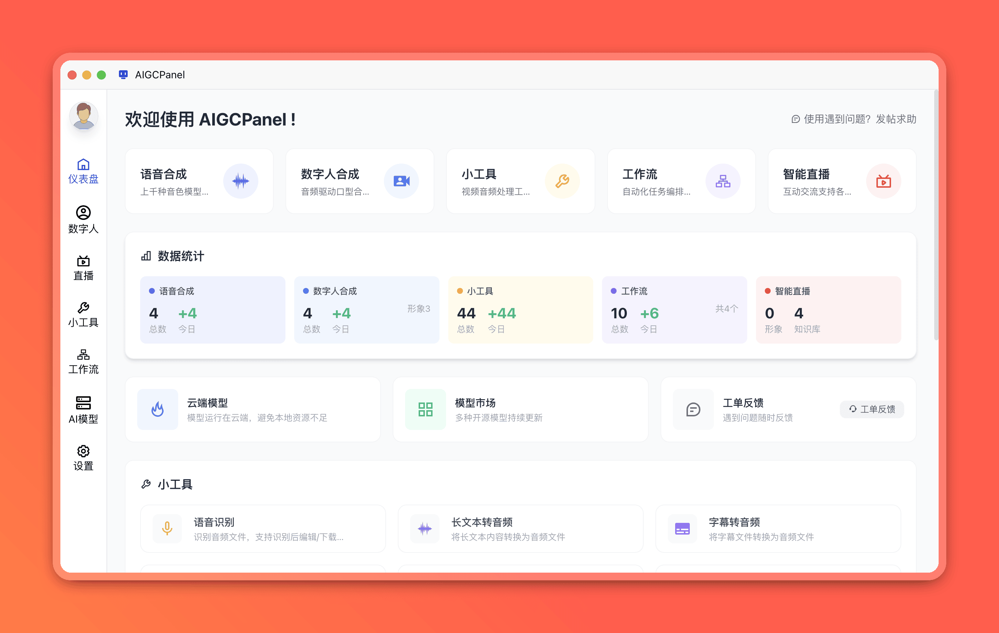
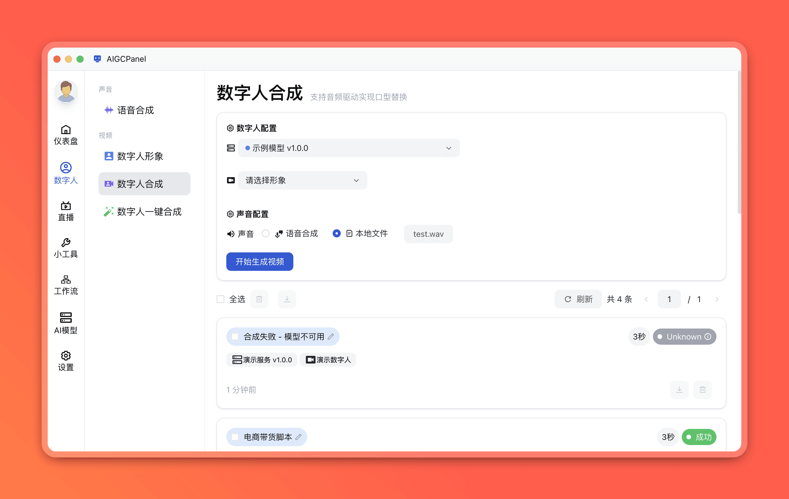
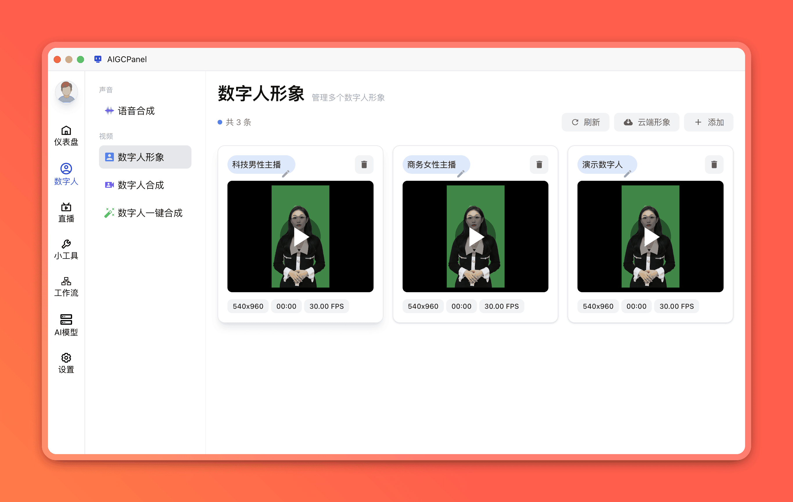
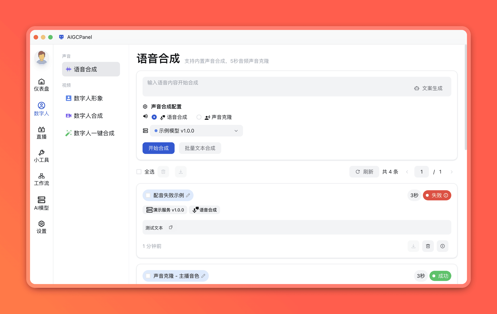
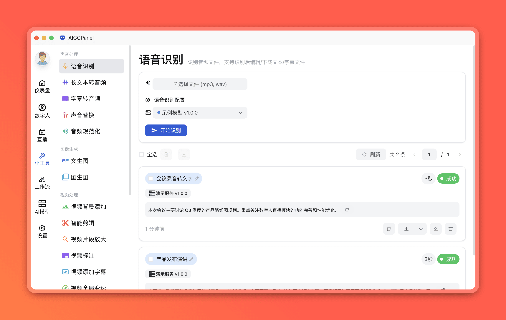
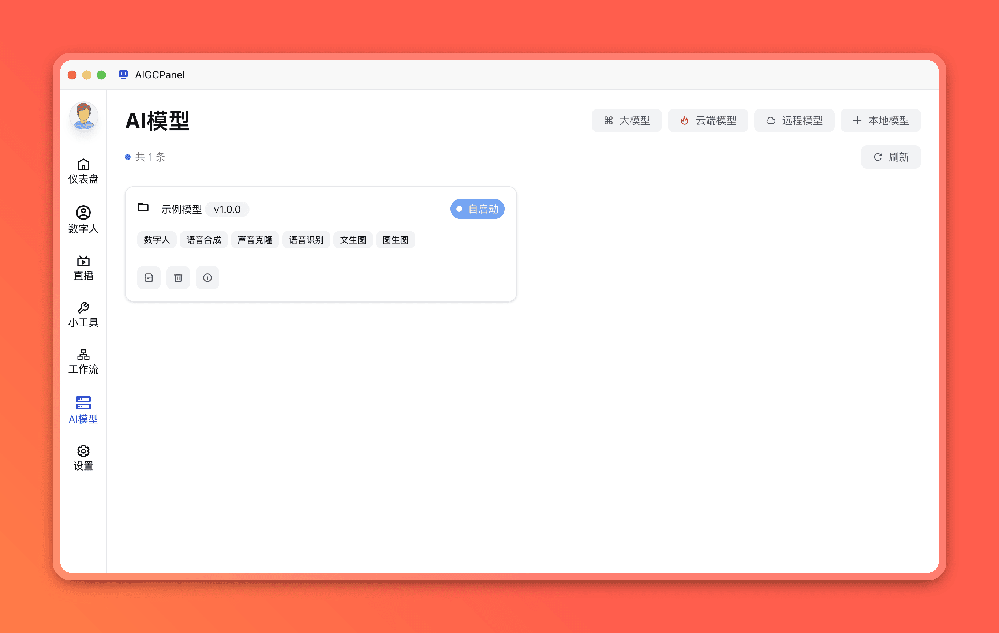
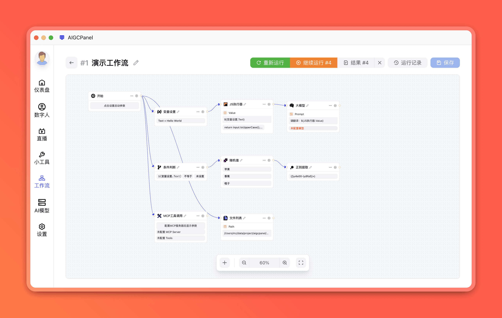
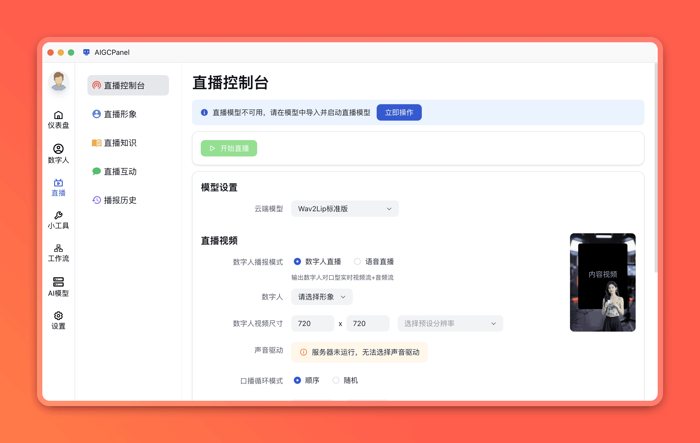
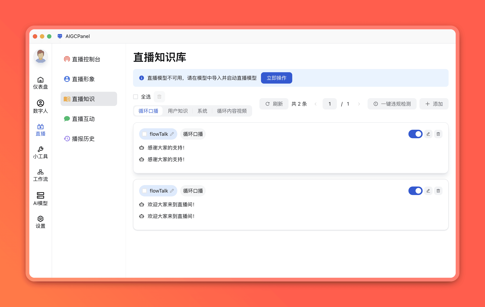
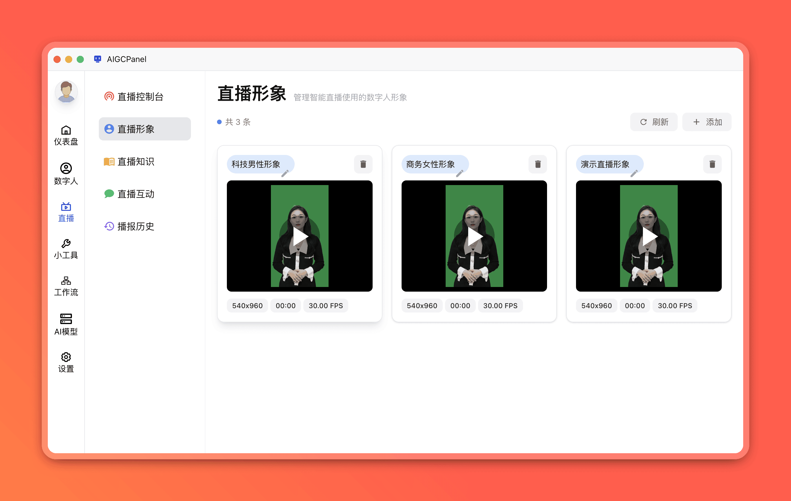

# AIGCPanel 数字人




[](https://aigcpanel.com)
[](https://github.com/modstart-lib/aigcpanel)
[](https://gitee.com/modstart-lib/aigcpanel)

## 软件介绍

AIGCPanel 是一款简单易用的一站式 AI 数字人桌面应用，支持 Windows / macOS / Linux 三平台。无需深厚技术背景，普通用户也能快速上手，将本地 AI 模型变成生产力工具。

核心能力涵盖：**数字人视频合成**（换口型）、**语音合成 / 克隆 / 识别**、**25+ 音视频处理工具**、**智能直播互动**，Pro 版额外提供**可视化工作流编排**和**云端 AI 模型服务**。

软件内置模型市场，支持一键下载启动包，开箱即用；同时兼容远程 API 模型，灵活适配各类部署场景。

> **重要提醒**：严禁将本产品用于任何违法违规业务，使用时须遵守中华人民共和国相关法律法规。

## 功能特性

**数字人合成**
- 基于多种开源口型同步模型（MuseTalk / LatentSync / Wav2Lip / Heygem），将任意音频与人物视频精准对齐
- 支持直接输入文本由语音模型合成后驱动，或上传本地音频文件驱动
- 支持绿幕视频形象，内置形象模板管理

**语音处理**
- 语音合成（TTS）：多模型支持，可调速度、音调等参数
- 语音克隆：上传参考音频即可克隆特定音色
- 语音识别（ASR）：输出带时间戳文字，可导出字幕文件（工具箱）
- 声音替换：一键将视频音轨替换为合成音频（工具箱）

**工具箱（25+ 工具）**
- 声音处理：长文本转音频、字幕转音频、**声音识别**（ASR，含时间戳/字幕导出）、声音替换、音频规范化
- 图像生成：文生图、图生图
- 视频处理：背景添加、智能剪辑、片段放大、标注、字幕、全局变速、片段变速、尺寸转换、压缩、片段删除/保留、片头片尾合并、添加音频、视频合并、格式转换、FFmpeg 自定义、一键合成流程

**可视化工作流**（VIP）
- 拖拽式节点编排：大模型（LLM）、JS 脚本、条件分支、MCP 工具调用、文件操作、变量、随机值、正则提取、全部工具箱节点
- 支持断点续跑、节点级状态追踪、运行历史查看

**智能直播**（VIP）
- 支持抖音、哔哩哔哩、虎牙、斗鱼、快手弹幕实时监控
- 知识库配置：问答流程、视频播放流程、自定义内容
- 违禁词检测与回复 Prompt 自定义
- 互动事件记录与播报历史查看

**AI 模型管理**
- 本地模型一键导入、启动/停止、日志查看、参数配置
- 支持远程 API 模型接入
- 云端 AI 模型服务（无需本地显卡）（VIP）

**其他**
- 命令行工具 `aigcpanel`：查询模型列表、调用模型函数
- 内置简体中文 / 英语双语界面
- 支持暗色模式

## 支持模型

### 声音合成

| 模型 | 说明 |
|---|---|
| [CosyVoice-300M](https://github.com/FunAudioLLM/CosyVoice) | 阿里通义实验室开源 TTS |
| [CosyVoice-300M-Instruct](https://github.com/FunAudioLLM/CosyVoice) | 指令控制版 |
| [CosyVoice2-0.5b](https://github.com/FunAudioLLM/CosyVoice) | 第二代轻量版 |
| [FishSpeech](https://github.com/fishaudio/fish-speech) | 高质量零样本语音克隆 |
| [IndexTTS](https://github.com/index-tts/index-tts) | 工业级中文 TTS |
| [SparkTTS](https://github.com/SparkAudio/Spark-TTS) | 讯飞开源语音合成 |
| [GPT-SoVITS](https://github.com/RVC-Boss/GPT-SoVITS) | 少样本声音克隆 |

### 声音识别

| 模型 | 说明 |
|---|---|
| [FunASR](https://github.com/modelscope/FunASR) | 阿里达摩院开源 ASR，支持带时间戳输出 |

### 视频模型

| 模型 | 说明 |
|---|---|
| [MuseTalk](https://github.com/TMElyralab/MuseTalk) | 腾讯音乐实时口型同步 |
| [LatentSync](https://github.com/bytedance/LatentSync) | 字节跳动高质量口型同步 |
| [Wav2Lip](https://github.com/Rudrabha/Wav2Lip) | 经典口型同步模型 |
| [Heygem](https://github.com/duixcom/Duix.Heygem) | 全身数字人驱动 |

## 功能预览

### 首页仪表盘

快速导航入口 + 数据统计（语音合成、数字人合成、工具箱使用量，以及工作流（VIP）、智能直播形象与知识库数量）。


### 数字人合成

上传形象视频，输入文本或音频，一键生成换口型数字人视频。支持多种口型同步模型切换。



### 我的形象

管理数字人形象模板，支持普通视频和绿幕视频。



### 语音合成

多模型 TTS，支持语音克隆（上传参考音频）、速度/音调调节，任务列表可批量下载。



### 工具箱

25+ 音视频处理工具，覆盖日常 AI 创作所需的全部音视频处理流程。包含声音识别（ASR）、长文本转音频、字幕转音频、声音替换、文生图、图生图，以及背景添加、智能剪辑、字幕、变速、压缩等视频处理工具。



### AI 模型管理

统一管理本地模型和远程 API 模型。支持一键启动/停止、实时日志查看、参数配置。云端 AI 模型服务（VIP）无需本地显卡。



### 可视化工作流（VIP）

拖拽式节点编排，将大模型调用、脚本处理、音视频工具串联成自动化流水线。支持断点续跑和运行历史追踪。

| 节点类型 | 说明 |
|---|---|
| 大模型（LLM） | 调用配置的 AI 模型生成文本 |
| JS 脚本 | 执行自定义 JavaScript 逻辑 |
| 条件分支 | 根据条件控制流程走向 |
| MCP 工具调用 | 调用 MCP 协议工具 |
| 文件操作 | 复制、移动、列表读取 |
| 变量 / 随机值 | 定义变量或生成随机数据 |
| 正则提取 | 从文本中提取结构化内容 |
| 工具节点 | 直接调用工具箱内任意工具 |



### 智能直播

多平台弹幕监控 + 自动互动应答。配置知识库后，系统根据弹幕内容自动播报对应的语音或视频。



**直播知识库**：配置触发词与回复内容，支持文字回复和视频播放两种模式。违禁词检测和回复 Prompt 自定义（VIP）。



**直播形象**：管理直播使用的数字人形象视频。



## 安装使用

从 [aigcpanel.com](https://aigcpanel.com) 下载对应平台安装包，安装后打开软件，进入模型管理下载所需模型的一键启动包，即可开始使用。

### Windows

下载 `.exe` 安装包，双击安装，无需额外配置。

### macOS

下载 `.dmg` 安装包，支持 Intel 和 Apple Silicon（M 系列芯片）。首次运行若提示来自未知开发者，在「系统设置 → 隐私与安全性」中点击「仍要打开」即可。

### Linux

提供 AppImage 和 deb 两种格式：
- AppImage：`chmod +x AIGCPanel.AppImage && ./AIGCPanel.AppImage`
- deb：`sudo dpkg -i AIGCPanel.deb`

## 技术栈

| 技术 | 用途 |
|---|---|
| [Electron](https://www.electronjs.org/) | 跨平台桌面应用框架 |
| [Vue 3](https://vuejs.org/) | 前端 UI 框架 |
| [TypeScript](https://www.typescriptlang.org/) | 类型安全 |
| [Arco Design](https://arco.design/) | UI 组件库（字节跳动） |
| [TailwindCSS](https://tailwindcss.com/) | 原子化 CSS |
| [Vite](https://vitejs.dev/) | 构建工具 |
| [better-sqlite3](https://github.com/WiseLibs/better-sqlite3) | 本地数据持久化 |
| [LogicFlow](https://site.logic-flow.cn/) | 工作流画布引擎 |

## 本地开发

> Node.js 20 及以上版本

```shell
# 安装依赖
npm install

# 开发模式运行
npm run dev

# 编译检查（TypeScript 无报错）
npm run build:preview

# 完整打包
npm run build
```

## 命令行工具

`aigcpanel` CLI 支持在终端直接调用模型，适合脚本集成场景。

可在软件「设置 → 命令行工具」界面一键安装到系统 PATH，也可手动将 `dist-cli/` 目录下对应平台的可执行文件加入 PATH。

```shell
aigcpanel --help

# 查询可用模型
aigcpanel model list

# 调用模型函数
aigcpanel model call <modelName> <function> [args...]
```

## 问题反馈

- 在 [Issues](../../issues) 页面搜索是否已有相同问题
- 提交新 Issue 时请附上操作系统、软件版本和复现步骤
- 技术讨论欢迎加入下方交流群

## 更新日志

详见 [CHANGELOG.md](./changelog.md)。

## 加入交流群

> 添加时请备注 AIGCPanel

<table width="100%">
    <thead>
        <tr>
            <th width="50%">微信交流群</th>
            <th>QQ 交流群</th>
        </tr>
    </thead>
    <tbody>
        <tr>
            <td>
                
            </td>
            <td>
                
            </td>
        </tr>
    </tbody>
</table>

## License

Apache-2.0
